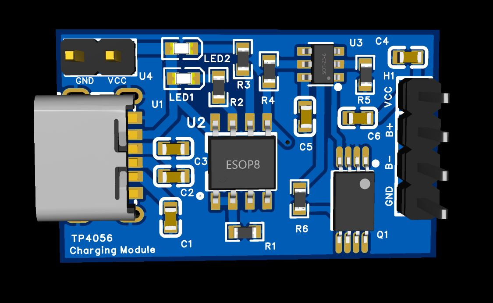
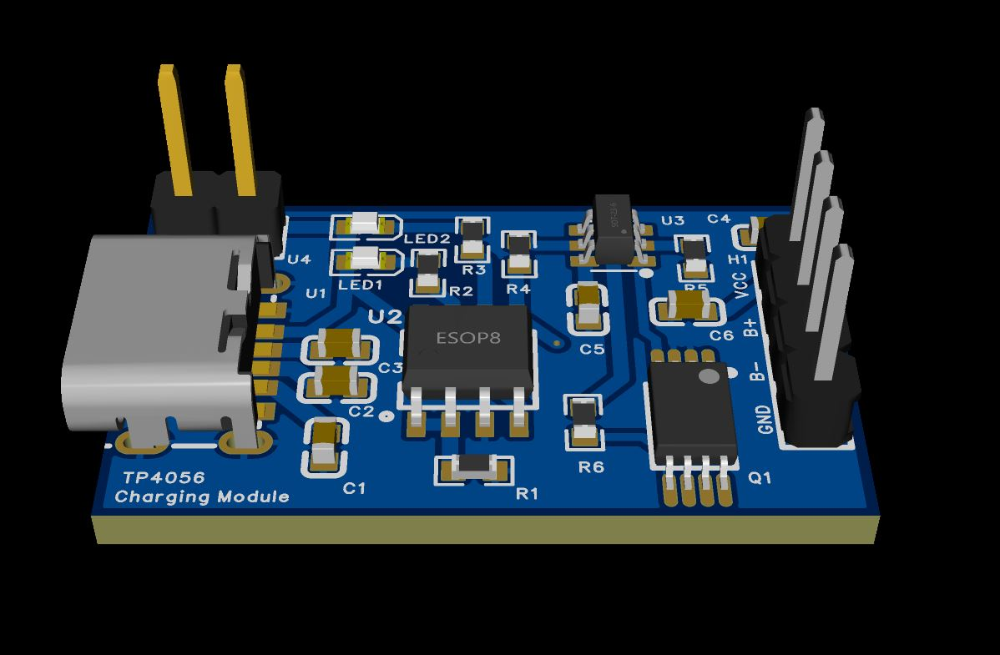
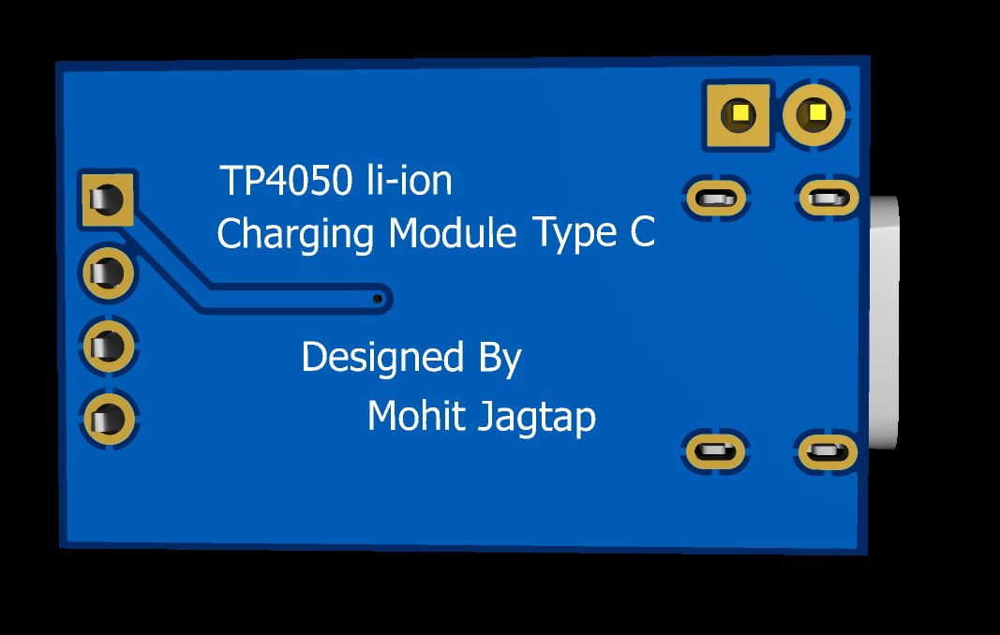
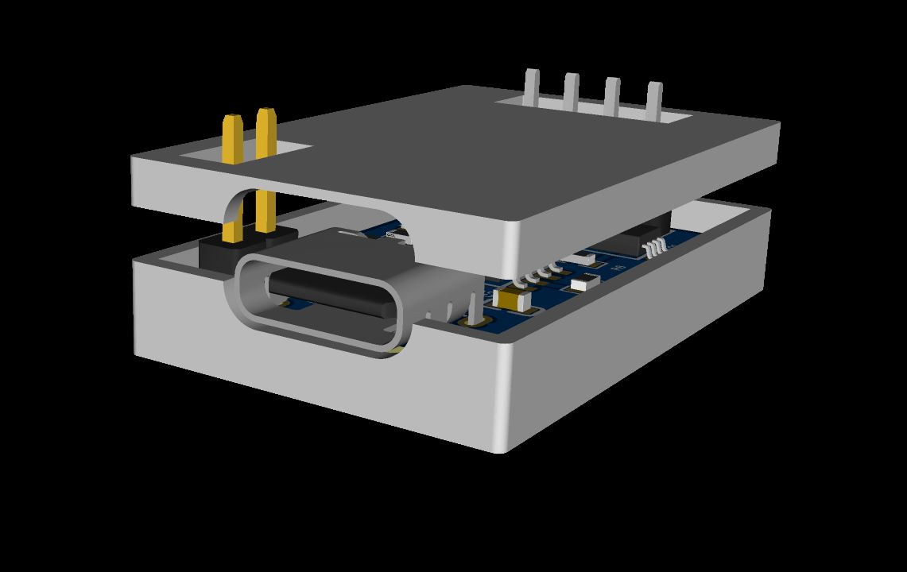

# 🔋 TP4056 USB-C Li-ion Battery Charging Module

<div align="center">


<br/>

> **A compact, fully custom-designed TP4056-based Li-ion battery charger module** with USB-C input, onboard DW01 + FS8205A battery protection, charging/standby status LEDs, and a clean 2×4 output header — designed from scratch in EasyEDA.

</div>

---

## 📸 Project Gallery

<div align="center">

<table>
  <tr>
    <td align="center"><b>🔭 3D Top View</b></td>
    <td align="center"><b>📐 3D Perspective</b></td>
  </tr>
  <tr>
    <td></td>
    <td></td>
  </tr>
  <tr>
    <td align="center"><b>🔽 Bottom View</b></td>
    <td align="center"><b>📦 Shell View</b></td>
  </tr>
  <tr>
    <td></td>
    <td></td>
  </tr>
</table>

</div>

---

## 📋 Table of Contents

- [Overview](#-overview)
- [Features](#-features)
- [Circuit Description](#-circuit-description)
- [Hardware Specifications](#-hardware-specifications)
- [Pin Header (H1) Pinout](#-pin-header-h1-pinout)
- [Schematic](#-schematic)
- [Bill of Materials (BOM)](#-bill-of-materials-bom)
- [Charging Indicator LEDs](#-charging-indicator-leds)
- [Charge Current Setting](#-charge-current-setting)
- [Getting Started](#-getting-started)
- [Project Files](#-project-files)
- [3D Model & Enclosure](#-3d-model--enclosure)
- [Safety Notes](#%EF%B8%8F-safety-notes)
- [Contributing](#-contributing)
- [Author](#-author)
- [License](#-license)

---

## 🔍 Overview

This module is a **single-cell Li-ion / Li-Po battery charger** built around the **TP4056** constant-current/constant-voltage (CC/CV) charger IC. It accepts power via a **USB-C connector**, charges the battery with full protection, and exposes battery and power rails through a **2×4 pin header (H1)**.

The design integrates:
- **TP4056** — handles CC/CV charging with thermal regulation
- **DW01** — provides over-charge, over-discharge, and short-circuit protection
- **FS8205A** — dual N-channel MOSFET switch controlled by DW01 for load/charge path isolation
- **Status LEDs** — real-time visual feedback for charging and standby states

---

## ✨ Features

- 🔌 **USB-C Input** — Modern connector, no polarity issues
- ⚡ **TP4056 CC/CV Charger** — 4.2V charge voltage, programmable charge current
- 🛡️ **Full Battery Protection** via DW01 + FS8205A:
  - Over-charge protection
  - Over-discharge protection
  - Over-current / short-circuit protection
- 💡 **Dual Status LEDs**:
  - 🔴 `LED1 (CHRG)` — Charging in progress
  - 🟢 `LED2 (STDBY)` — Charge complete / Standby
- 🧩 **2×4 Pin Header (H1)** — Exposes BAT+, BAT−, VCC, GND for easy integration
- 📐 **Compact Form Factor** — Designed for embedding in projects
- 📦 **Optional 3D-Printed Enclosure** — Shell included

---

## 🔬 Circuit Description

### Power Path

```
USB-C (U1)
  └─ VBUS ──► R1 (150Ω) ──► VCC rail
                              │
                         TP4056 (U2)
                              │
                         BAT pin ──► DW01 (U3)
                                          │
                                     FS8205A (Q1)
                                          │
                                    Battery Output (H1)
```

### Key ICs

| IC | Role |
|----|------|
| **U1** — USB-C Female | 5V power input (VBUS lines A9+B9, GND A12+B12) |
| **U2** — TP4056 | CC/CV Li-ion charger, 4.2V termination |
| **U3** — DW01 | Battery protection controller |
| **Q1** — FS8205A | Dual MOSFET for protection switching |

### TP4056 Pin Functions (U2)

| Pin | Name | Function |
|-----|------|----------|
| 1 | TEMP | Temperature monitoring (tied to VCC via R — disabled) |
| 2 | PROG | Charge current set resistor |
| 3 | GND | Ground |
| 4 | VCC | 5V input supply |
| 5 | BAT | Battery positive terminal |
| 6 | STDBY | Standby LED indicator (active low) |
| 7 | CHRG | Charging LED indicator (active low) |
| 8 | CE | Chip enable (active high, tied to VCC) |

---

## 🔧 Hardware Specifications

| Parameter | Value |
|-----------|-------|
| Input Connector | USB-C (Type-C Female) |
| Input Voltage | 5V (from USB) |
| Charge Voltage | 4.2V (fixed, TP4056) |
| Charge Current | ~1A (set by PROG resistor) |
| Battery Type | Single-cell Li-ion / Li-Po |
| Protection IC | DW01 |
| MOSFET | FS8205A (Dual N-Channel) |
| Output Header | 2.54mm 2×4 Pin (H1) |
| Status Indicators | 2× LEDs (CHRG + STDBY) |
| PCB Layers | 2-Layer |
| EDA Tool | EasyEDA (LCEDA) |
| Schematic Version | V1.0 |
| Created | 2026-04-02 |
| Updated | 2026-04-09 |

---

## 📌 Pin Header (H1) Pinout

**H1 — HDR2.54-LI-2×4P** (2.54mm pitch, 2×4 = 8 pins)

| Pin | Label | Description |
|-----|-------|-------------|
| 1 | VCC | 5V input from USB-C |
| 2 | GND | Ground |
| 3 | BAT+ | Battery positive (protected output) |
| 4 | BAT− | Battery negative / GND |
| 5 | CHRG | Charging status (active LOW, connect LED or logic) |
| 6 | STDBY | Standby/Full status (active LOW) |
| 7 | GND | Ground |
| 8 | VCC | 5V input (mirrored) |

> ⚠️ Refer to the schematic `schematic.pdf` for the exact net assignments.

---

## 📄 Schematic

The full schematic is included as `schematic.pdf`.

**Key nets at a glance:**

```
VBUS  ──► R1(150Ω) ──► VCC
VCC   ──► TP4056 VCC (pin 4)
           TP4056 CE (pin 8) — always enabled
           TP4056 TEMP (pin 1) via R

TP4056 PROG (pin 2) ──► R4/R5 (150Ω) ──► GND
           (Sets ~1A charge current: IPROG = 1200 / RPROG)

TP4056 BAT (pin 5) ──► DW01 (U3) ──► FS8205A (Q1) ──► BAT output

CHRG (pin 7) ──► R2(1kΩ) ──► LED1 ──► GND
STDBY (pin 6) ──► R3(1kΩ) ──► LED2 ──► GND
```

---

## 🧾 Bill of Materials (BOM)

> Full BOM: `BOM_Board1_TP4050_2026-04-09.xlsx`

| Ref | Component | Package | Value / Part |
|-----|-----------|---------|--------------|
| U1 | USB-C Female Connector | SMD | Type-C Receptacle (tpyec) |
| U2 | Li-ion Charger IC | SOP-8 | TP4056 |
| U3 | Battery Protection IC | SOT-23-6 | DW01 |
| Q1 | Dual N-Ch MOSFET | SOT-23-8 | FS8205A |
| LED1 | Charging Indicator | 0402 LED | Red |
| LED2 | Standby Indicator | 0402 LED | Green |
| R1 | Input Resistor | 0402 | 150Ω |
| R2 | LED Resistor | 0402 | 1kΩ |
| R3 | LED Resistor | 0402 | 1kΩ |
| R4 | PROG Resistor | 0402 | 150Ω |
| R5 | PROG Resistor | 0402 | 150Ω |
| R6 | Zero-ohm jumper | 0402 | 0Ω |
| C1–C6 | Decoupling Caps | 0402 | 220pF |
| H1 | Output Header | 2.54mm THT | 2×4P HDR |

---

## 💡 Charging Indicator LEDs

| LED | Color | State | Meaning |
|-----|-------|-------|---------|
| LED1 (CHRG) | 🔴 Red | **ON** | Battery charging in progress |
| LED1 (CHRG) | 🔴 Red | **OFF** | Charging complete or no battery |
| LED2 (STDBY) | 🟢 Green | **ON** | Charge complete — battery full |
| LED2 (STDBY) | 🟢 Green | **OFF** | Charging or no input power |

> Both LEDs ON simultaneously briefly during startup is normal.

---

## ⚙️ Charge Current Setting

The charge current is set by the **PROG resistor** (R4/R5):

```
I_charge (mA) = 1200 / R_PROG (kΩ)
```

| RPROG | Charge Current |
|-------|---------------|
| 1.2kΩ | ~1000 mA (1A) |
| 2kΩ   | ~600 mA |
| 3kΩ   | ~400 mA |
| 10kΩ  | ~120 mA |

> This design uses R4 + R5 = **150Ω** in the PROG path. Verify against your schematic and adjust for your battery's recommended charge rate (typically **0.5C** to **1C**).

---

## 🚀 Getting Started

### Assembly Order

1. **Solder SMD components first**: U2 (TP4056), U3 (DW01), Q1 (FS8205A), then all 0402 passives (R, C, LEDs)
2. **Solder USB-C connector** (U1) — use flux generously
3. **Solder 2×4 pin header** (H1) last
4. **Inspect** all joints, especially USB-C pads

### Testing

1. Connect USB-C — both LEDs may flash briefly
2. **Without battery**: STDBY LED should turn on (no load)
3. **With battery connected to H1 (BAT+/BAT−)**:
   - `LED1 (RED)` ON → Charging
   - `LED2 (GREEN)` ON → Battery full
4. Measure BAT pin voltage — should ramp to **4.2V**

### PCB Fabrication

Upload `Gerber_PCB1_2026-04-09.zip` to your preferred fab:

| Setting | Value |
|---------|-------|
| Layers | 2 |
| Board Thickness | 1.6mm |
| Surface Finish | HASL (Lead-free) |
| Min Hole Size | 0.3mm |
| Copper Weight | 1 oz |

---

## 📂 Project Files

```
TP4056-USB-C-Charger-Module/
│
├── 📄 schematic.pdf                     # Full circuit schematic (EasyEDA)
├── 📁 Gerber_PCB1_2026-04-09/           # Gerber files for PCB fab
├── 📄 BOM_Board1_TP4050_2026-04-09.xlsx # Bill of Materials
├── 📄 3D_step_file.step                 # 3D STEP model (if available)
├── 📁 3DShell_PCB1/                     # 3D-printable enclosure files
├── 🖼️  3D_Top_view.JPG                  # 3D top render
├── 🖼️  3D_view.JPG                      # 3D perspective render
├── 🖼️  Bottom_view.JPG                  # PCB bottom render
├── 🖼️  shell_view.JPG                   # Enclosure render
└── 📄 README.md                         # This file
```

---

## 🏠 3D Model & Enclosure

A custom **3D-printable enclosure** (shell) was designed to fit this module.

- Files located in `3DShell_PCB1/`
- Print in **PLA or PETG**, 0.2mm layer height, 20% infill
- Exposes USB-C port and pin header H1

---

## ⚠️ Safety Notes

> Please read before connecting a battery!

- ✅ Only use with **single-cell (3.7V nominal) Li-ion or Li-Po** batteries
- ✅ Always check battery polarity before connecting to H1
- ✅ The DW01 + FS8205A provides protection, but **never leave charging unattended for extended periods**
- ❌ Do not connect batteries above **4.2V** or below **2.5V** to this module
- ❌ Do not short the BAT output pins
- ❌ Do not supply more than **5.5V** to the USB-C input

---

## 🤝 Contributing

Contributions, issues, and suggestions are welcome!

1. Fork the repo
2. Create your branch: `git checkout -b feature/improvement`
3. Commit: `git commit -m 'Add improvement'`
4. Push: `git push origin feature/improvement`
5. Open a Pull Request

---

## 👨‍🎓 Author

<div align="center">

### Mohit Jagtap

**Electronics & Telecommunication Engineering**  
Dr. D. Y. Patil Institute of Engineering Management and Research  
Akurdi, Pune

[](https://mohitjagtap.netlify.app/)
[](https://github.com/itsmemohitjagtap)

</div>

---

---

<div align="center">

**⭐ Found this useful? Give it a star! ⭐**

Made with ❤️ in Pune, India 🇮🇳

</div>
